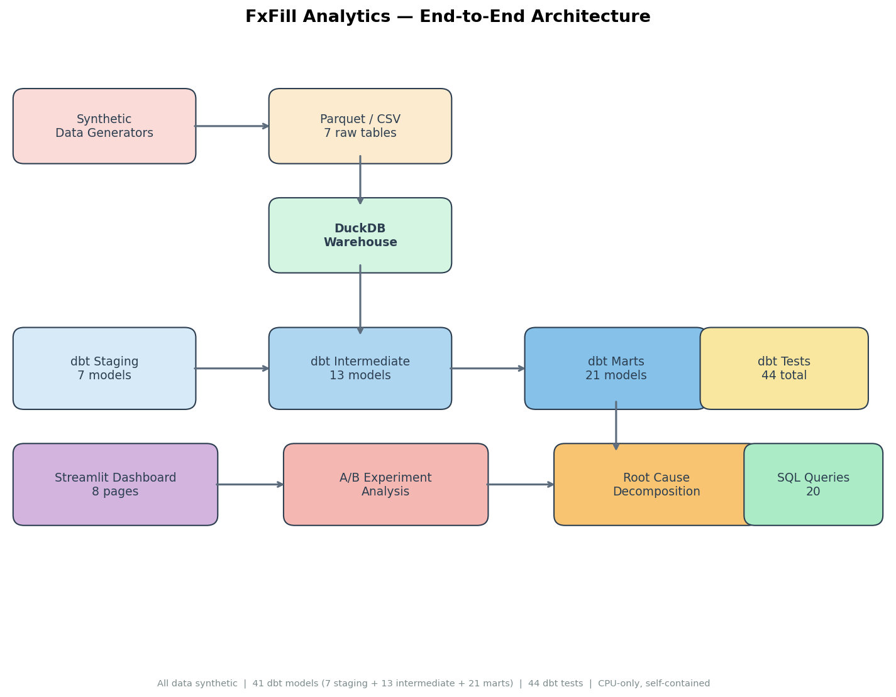
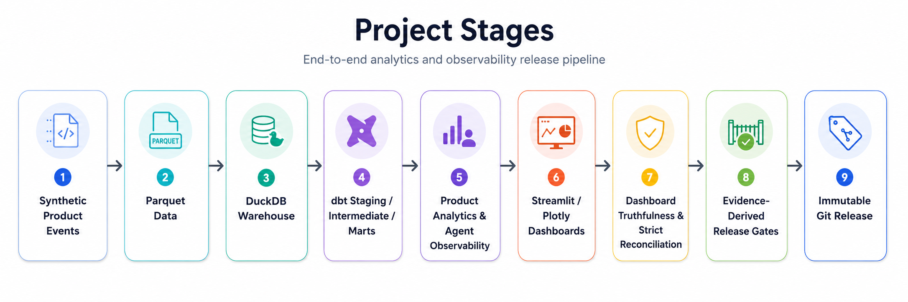
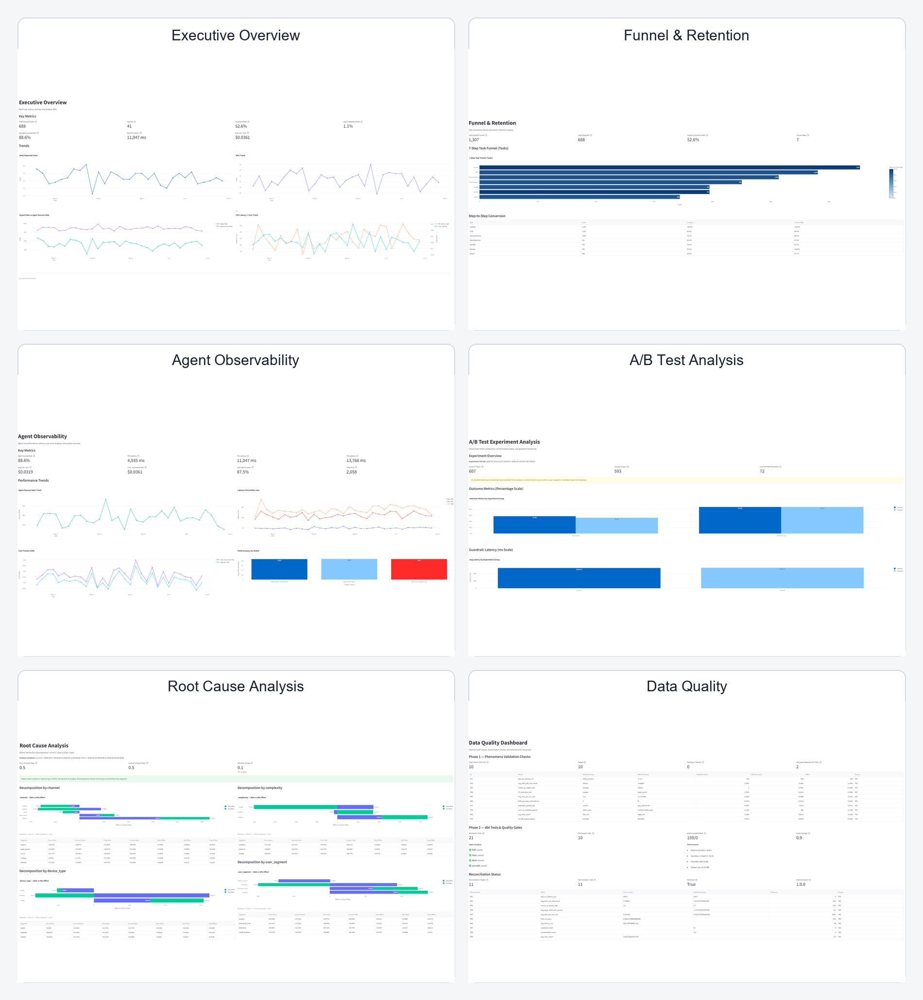

# FxFill Analytics & AI Agent Observability Platform

An evidence-driven analytics engineering and AI agent observability platform built with Python, DuckDB, dbt, Streamlit, and machine-verifiable data-quality gates.

> **Portfolio scope:** All product, user, agent, and financial data in this repository is synthetic. The project is a local reference implementation and is not a deployed banking or production SaaS system.

[](https://www.python.org/)
[](https://duckdb.org/)
[](https://docs.getdbt.com/)
[](https://streamlit.io/)
[](https://github.com/Tito-999/fxfill-analytics-observability)
[](https://github.com/Tito-999/fxfill-analytics-observability)
[](https://github.com/Tito-999/fxfill-analytics-observability)
[](https://github.com/Tito-999/fxfill-analytics-observability/releases/tag/portfolio-v1.2.12)
[](https://github.com/Tito-999/fxfill-analytics-observability)

---

## Overview

FxFill Analytics is a complete analytics engineering reference that models a simulated AI agent product assisting users with cross-border remittance form filling. The platform covers the full pipeline from synthetic data generation through dimensional modeling, business intelligence dashboards, and experiment-driven decision-making.

The project demonstrates six integrated capability layers: **Product Analytics** (conversion funnels, activation, retention cohorts, feature adoption), **Analytics Engineering** (DuckDB + dbt staging/intermediate/mart layers with 41 models and 44 data tests), **AI Agent Observability** (success rates, latency percentiles, token usage, cost, model distribution, and error categories), **Dashboard Truthfulness** (cross-layer UI-to-database metric reconciliation with NaN/None guards and Plotly trace inspection), **Data Quality** (provenance checks, strict row-level reconciliation, stored pass-flag recomputation, and stale-artifact detection), and **Evidence-Driven Release Verification** (11 required gates with PASS/FAIL/NOT_RUN semantics backed by SHA-256-hashed dbt artifacts and immutable Git tags).

---

## Quick Start

**Windows PowerShell:**

```powershell
git clone https://github.com/Tito-999/fxfill-analytics-observability.git
cd fxfill-analytics-observability

conda create -n fxfill_analytics python=3.11 -y
conda activate fxfill_analytics

python -m pip install --upgrade pip
python -m pip install -r requirements.txt
python -m pip install -r requirements-dev.txt
python -m pip install -e .

# dbt profiles.yml is gitignored; create it before verification
@'
fxfill_analytics:
  target: dev
  outputs:
    dev:
      type: duckdb
      path: "{{ env_var('FXFILL_DUCKDB_PATH', '../../warehouse/fxfill.duckdb') }}"
      schema: main
      threads: 4
'@ | Out-File -Encoding utf8 dbt_fxfill/profiles.yml

$env:PYTHONNOUSERSITE = "1"
$env:NO_PROXY = "127.0.0.1,localhost"

python scripts\verify_core_release.py
```

Expected result:

- Core acceptance: `true`
- Required release gates: 11 / 11 `PASS`
- pytest: 406 / 406 passed
- dbt models: 41 / 41 successful
- dbt tests: 44 / 44 passed

> The immutable portfolio-v1.2.12 baseline is recorded in the [release evidence](reports/portfolio/releases/portfolio-v1.2.12/). Current master additionally includes the validated Windows clean-clone portability fix.

---

## Architecture



The data pipeline flows through these stages:

**Synthetic Product Events**
&rarr; **Parquet Data**
&rarr; **DuckDB Warehouse**
&rarr; **dbt Staging / Intermediate / Marts**
&rarr; **Product Analytics & Agent Observability**
&rarr; **Streamlit / Plotly Dashboards**
&rarr; **Dashboard Truthfulness & Strict Reconciliation**
&rarr; **Evidence-Derived Release Gates**
&rarr; **Immutable Git Release**



Additional architecture diagrams are available in `docs/portfolio/`:

1. **architecture.png** End-to-end pipeline from data generation to dashboard and experiment analysis
2. **data_flow.png** Data model layer details and transformation dependencies
3. **experiment_flow.png** A/B test pipeline from hypothesis to decision

---

## Key Capabilities

### Product Analytics

Conversion funnel analysis, activation tracking, weekly retention cohorts, feature adoption trends, export and abandonment metrics, A/B experiment evaluation with bootstrap confidence intervals, and Kitagawa root-cause decomposition.

### AI Agent Observability

Agent run volume, success and error rates, P50/P95 latency, token consumption, cost per task, model distribution, error category breakdowns, and date-filtered operational views across four monitored dashboard sections.

### Analytics Engineering

DuckDB warehouse with dbt staging (7 models), intermediate (13 models), and mart (21 models) layers 41 models total. 21 generic data tests and 23 singular tests enforce referential integrity, uniqueness, non-null constraints, and accepted-value checks.

### Dashboard Truthfulness

Automated database-to-UI metric reconciliation across pages, date-filter validation with zero violations, NaN/None rendering checks, retention maturity contract verification, and actual Plotly trace and point inspection (136 plotted points examined across 12 traces in 3 figures).

### Data Quality

Provenance checks confirming consistent run IDs across manifest and warehouse, strict row-level raw-to-staging reconciliation (7 tables, zero delta), finite-value checks, stored pass-flag recomputation, and stale-artifact detection.

### Release Verification

11 required release gates with PASS/FAIL/NOT_RUN semantics, dbt model and test artifacts confirmed separated with distinct hash paths, SHA-256 evidence chains, Git-tree candidate audit, and an annotated immutable release tag.

---

## Dashboard Pages



| Page | Description |
|------|-------------|
| **Home** | Platform overview, key metrics, and navigation |
| **Executive Overview** | Daily scorecard, weekly business review, high-level KPIs |
| **Conversion Funnel** | User journey through registration, upload, autofill, and export |
| **Retention & Cohorts** | Weekly retention cohorts and user lifecycle analysis |
| **Feature Adoption** | Feature-level usage trends and adoption rates |
| **Agent Observability** | Agent run traces, token usage, cost, error rates, and latency |
| **A/B Test Analysis** | Experiment results with bootstrap confidence intervals and segment effects |
| **Root Cause Analysis** | Export rate decomposition with Kitagawa method |
| **Data Quality** | Reconciliation, provenance, and data-quality guard results |

---

## Project Scale

| Metric | Count |
|---|---:|
| Source Tables | 7 |
| dbt Models | 41 |
| Staging | 7 |
| Intermediate | 13 |
| Marts | 21 |
| Generic dbt Tests | 21 |
| Singular dbt Tests | 23 |
| Total dbt Tests | 44 / 44 passed |
| SQL Analysis Queries | 20 |
| Streamlit Pages | 8 (1 Home + 7 Business) |
| Charts | ~30 |
| Bootstrap Iterations | 5,000 |
| Automated pytest Tests | 406 / 406 passed |
| Required Release Gates | 11 / 11 PASS |
| Latest Verified Release | `portfolio-v1.2.12` |

---

## Analytics Case Studies

### Root Cause: Export Rate Decomposition

Investigated a simulated decline in the form export rate by decomposing the overall change into rate effects and mix effects using the Kitagawa decomposition method. The analysis isolated which user segments drove the decline and whether the root cause was behavioral (lower conversion within segments) or compositional (shift toward lower-converting segments). The decomposition achieved a residual error of less than 1e-9, confirming internal consistency.

### A/B Test: validation_before_autofill_v1

Evaluated an experiment that introduced a validation step before form autofill. The analysis pipeline applied:

- Sample ratio mismatch (SRM) checks at the overall and segment levels
- Bootstrap resampling with 5,000 iterations for robust confidence intervals
- Segment-level effect analysis across user cohorts

The Phase 4 experiment decision was **SHIP**, indicating the feature demonstrated a statistically significant improvement with positive effect size.

---

## Engineering Quality

- **pytest:** 406 / 406 passed, with 0 failures, errors, or skips.
- **dbt models:** 41 / 41 executed successfully.
- **dbt tests:** 44 / 44 passed, including 21 generic and 23 singular tests.
- **Release gates:** 11 / 11 required gates reported `PASS`.
- **Code quality:** Ruff and Black passed; the changed verification module also passes mypy in an isolated Python 3.11 environment.
- **Dependency integrity:** `pip check` reported 0 conflicts in the isolated environment.
- **Dashboard smoke test:** HTTP health and home endpoints returned 200, with clean process termination and port release.
- **Public audit:** 0 high-severity and 0 medium-severity findings.

The release verifier derives acceptance from measured evidence. Missing checks remain `NOT_RUN`; warnings, failed gates, incomplete measurements, or inconsistent stored/recomputed results prevent acceptance.

---

## Verified Release Evidence

The latest verified release is [`portfolio-v1.2.12`](https://github.com/Tito-999/fxfill-analytics-observability/releases/tag/portfolio-v1.2.12).

- Code commit: `e1d54a10d28e33c66efabc69f44b76cf57e32fa9`
- Evidence/master commit: `839a910cf6b69f3f130ef2d3478da9d3bd745428`
- Core acceptance: `true`
- Required gates: 11 / 11 `PASS`
- pytest: 406 / 406 passed
- dbt models: 41 / 41 successful
- dbt tests: 44 / 44 passed

Release evidence files:

- [Core release acceptance](reports/portfolio/releases/portfolio-v1.2.12/core_release_acceptance.json)
- [Data quality snapshot](reports/portfolio/releases/portfolio-v1.2.12/data_quality_snapshot.json)
- [Dashboard truthfulness](reports/portfolio/releases/portfolio-v1.2.12/dashboard_truthfulness.json)
- [Business metric integrity](reports/portfolio/releases/portfolio-v1.2.12/business_metric_integrity.json)
- [Machine summary](reports/portfolio/releases/portfolio-v1.2.12/p2_8_4_machine_summary.json)
- [Release bundle manifest](reports/portfolio/releases/portfolio-v1.2.12/release_bundle_manifest.json)

---

## Repository Structure

```
fxfill-analytics-observability/
data/                    # Generated synthetic data (Parquet/CSV)
dbt_fxfill/              # dbt models and configurations
models/
staging/         # 7 staging models
intermediate/    # 13 intermediate models
marts/           # 21 analytics marts
tests/               # 21 generic + 23 singular dbt tests
docs/
portfolio/           # Architecture diagrams and screenshots
scripts/                 # Pipeline automation and verification scripts
sql/                     # 20 SQL analysis queries
dashboard/               # 8-page Streamlit dashboard
tests/                   # 406-test automated verification suite
src/
fxfill_analytics/
verification/    # Release verifier and artifact validators
reports/
portfolio/
releases/
portfolio-v1.2.12/  # Machine-verified release evidence
requirements.txt
requirements-dev.txt
README.md
```

---

## Releases

Latest verified release:

- [`portfolio-v1.2.12`](https://github.com/Tito-999/fxfill-analytics-observability/releases/tag/portfolio-v1.2.12)

Earlier tags are retained as immutable historical checkpoints.

---

## What This Project Demonstrates

Product analytics, analytics engineering, BI engineering, AI product analytics, agent observability, data quality engineering, and evidence-driven release verification in a self-contained, locally reproducible reference implementation.

---

## Limitations

- **Synthetic data only** 闁?all behavioral and operational data is programmatically generated
- **Portfolio/reference implementation** 闁?not a deployed banking or production SaaS system
- **No real customer PII** 闁?all user identities and transaction records are synthetic
- **No production banking transactions** 闁?financial figures are illustrative scenario assumptions
- **No cloud deployment** 闁?runs locally on DuckDB; no streaming ingestion
- **Local DuckDB-based analytical stack** 闁?not benchmarked for distributed or high-concurrency workloads
- **Agent telemetry is simulated** 闁?traces, spans, and cost figures are generated, not collected from a live AI service

---

## Author

Designed and built by Chengren Pang.

Development workflow included automated verification.

---

## License

MIT License — see [LICENSE](./LICENSE).
