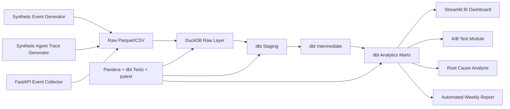

# FxFill Product Analytics & AI Agent Observability Platform

[](https://www.python.org/)
[](https://opensource.org/licenses/MIT)
[-lightgrey.svg)](./PROGRESS.md)

> **⚠️ SYNTHETIC DATA NOTICE:** All data in this repository is synthetically generated for demonstration purposes. This project is a portfolio piece — it does not contain real user data, real financial information, or live production data from any company.

---

## One-Line Value

A lightweight, laptop-runnable data analytics platform that demonstrates end-to-end product analytics and AI Agent observability — from synthetic data generation to business recommendations.

---

## Business Scenario

**FxFill** is a simulated AI Agent product that helps users fill cross-border remittance forms. The user journey:

```
Register → Upload Document → OCR → PII Anonymization → Risk Detection
→ Field Extraction → Form Autofill → Manual Review → Export Form
```

The AI Agent internally executes:

```
FxFill Task
├── document_classification
├── ocr_extraction
├── pii_detection
├── anonymization
├── risk_detection
├── field_mapping
├── form_autofill
└── output_validation
```

This platform monitors the full product + agent pipeline: user behavior, conversion funnels, agent performance, cost, errors, and A/B experiments.

---

## Tech Stack

| Layer | Technology | Purpose |
|-------|-----------|---------|
| Language | Python 3.11 | Data gen, ETL, stats, API, reports |
| Processing | Pandas, NumPy | Cleaning, aggregation, features |
| OLAP | DuckDB | Local SQL analytics |
| Modeling | dbt-core + dbt-duckdb | Staging, intermediate, marts |
| Stats | SciPy, statsmodels | A/B testing, confidence intervals |
| Dashboard | Streamlit + Plotly | BI dashboards (7 pages) |
| API | FastAPI + Pydantic | Event collection |
| Quality | Pandera, dbt tests, pytest | Schema and business rule validation |
| Config | YAML, python-dotenv | Metrics, experiments, app settings |

---

## Quick Start

> **Platform:** Windows 10/11 (PowerShell). Also works on macOS/Linux with equivalent bash commands.

```powershell
# 1. Clone and enter
git clone <this-repo>
cd fxfill-analytics-observability

# 2. Setup environment
.\scripts\setup.ps1
.\.venv\Scripts\Activate.ps1

# 3. Run with tiny data (smoke test)
python scripts/generate_data.py --size tiny --seed 20260616
python scripts/build_warehouse.py
pytest tests/ -v

# 4. Full pipeline (medium data)
.\scripts\run_all.ps1 -Size medium

# 5. Launch dashboard
.\scripts\run_dashboard.ps1
# Open http://localhost:8501
```

---

## Architecture



---

## Data Model (High-Level)

| Layer | Example Models |
|-------|---------------|
| **Raw** | `raw_users`, `raw_product_events`, `raw_agent_runs`, `raw_agent_spans` |
| **Staging** | `stg_users`, `stg_product_events`, `stg_agent_runs` |
| **Intermediate** | `int_task_funnel_flags`, `int_user_cohorts`, `int_agent_trace_rollup` |
| **Marts (Product)** | `mart_conversion_funnel`, `mart_retention_cohort`, `mart_feature_adoption` |
| **Marts (Agent)** | `mart_agent_daily_kpis`, `mart_model_version_comparison`, `mart_cost_quality_tradeoff` |
| **Marts (Experiment)** | `mart_ab_test_summary`, `mart_ab_test_segment_effects` |
| **Marts (Executive)** | `mart_executive_daily_scorecard`, `mart_weekly_business_review` |

---

## Project Status

🚧 **Phase 0 (Scaffold)** — in progress.

See [`IMPLEMENTATION_PLAN.md`](./IMPLEMENTATION_PLAN.md) for the full phase breakdown.
See [`PROGRESS.md`](./PROGRESS.md) for current progress.

---

## Key Features (Planned)

- [ ] 7-page Streamlit BI dashboard
- [ ] Full conversion funnel + cohort retention
- [ ] 20 SQL interview queries with documentation
- [ ] A/B test with SRM checks, bootstrap CIs, segment analysis
- [ ] Root cause analysis: export rate decline case study
- [ ] Agent observability: traces, spans, tokens, cost, errors
- [ ] Data quality: Pandera schemas, dbt tests, 6 rule categories
- [ ] FastAPI event collector
- [ ] Automated weekly business review
- [ ] Windows PowerShell one-click run scripts

---

## Hardware Requirements

- **CPU:** Intel i7-13700HX or equivalent (tested)
- **RAM:** 16 GB (peak usage < 6 GB for full pipeline)
- **GPU:** Optional (RTX 4060 8GB for local LLM features)
- **Storage:** ~500 MB for database and generated data (medium)
- **OS:** Windows 10/11 (primary), macOS/Linux supported

---

## Data & Privacy

- ✅ **All data is synthetic** — generated programmatically with fixed random seeds
- ✅ **No real user data** — no PII, no financial records, no production data
- ✅ **Simulated pricing** — model costs are for demonstration, not real provider pricing
- ✅ **Embedded phenomena** — 10 configurable "issues" are intentionally implanted for analysis detection
- ✅ **No API keys committed** — use `.env.example` as template

---

## License

MIT License — see [`LICENSE`](./LICENSE).

---

## Open-Source Attribution

This project builds on: DuckDB, dbt, Streamlit, FastAPI, Pandas, Plotly, SciPy, statsmodels, Pandera, and many more. The creative work is in the data model, SQL queries, analysis methodology, dashboard design, and business reasoning — not in owning the underlying platforms.

---

## Author

Data Analyst Portfolio Project — .
